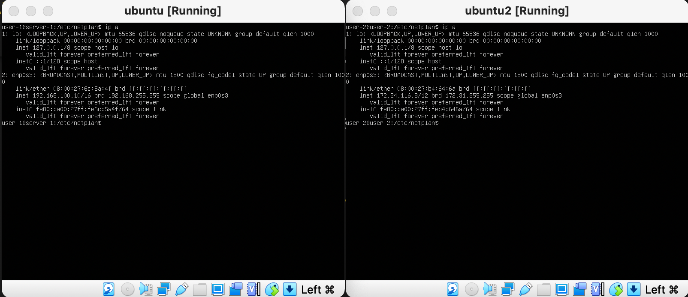

# Сети в Linux
Настройка сетей в Linux на виртуальных машинах.
##  Содержание
   1. [Стек протоколов TCP IP](#стек-протоколов-tcp-ip)
   2. [Адресация](#адресация)
   3. [Маршрутизация](#маршрутизация)
   4. [Инструмент ipcalc](#part-1-инструмент-ipcalc)
   5. [Статическая маршрутизация между двумя машинами](#part-2-статическая-маршрутизация-между-двумя-машинами)
   6. [Утилита iperf3](#part-3-утилита-iperf3)
   7. [Сетевой экран](#part-4-сетевой-экран)
   8. [Статическая маршрутизация сети](#part-5-статическая-маршрутизация-сети)
   9. [Динамическая настройка IP с помощью DHCP](#part-6-динамическая-настройка-ip-с-помощью-dhcp)
   10. [NAT](#part-7-nat)
   11. [Допополнительно. Знакомство с SSH Tunnels](#part-8-дополнительно-знакомство-с-ssh-tunnels)

## Part 1. Инструмент **ipcalc**
использованные команды:
* `ipcalc 192.167.38.54/13`

* `ipcalc 192.167.38.54 255.255.255.0`

* `ipcalc 192.167.38.54/15`

* `ipcalc 192.167.38.54 255.255.255.240`

* `ipcalc 12.167.38.4/8 && ipcalc 12.167.38.4 255.255.0.0 && ipcalc 12.167.38.4 255.255.254.0`

* `ipcalc 12.167.38.4/4`

* только 127.0.0.2, так как ip хоста 127.0.0.1 
* публичные:
* 134.43.0.2, 192.168.4.2, 172.0.2.1, 192.172.0.1, 172.68.0.2, 192.169.168.1
* частные:
* 10.0.0.45, 172.20.250.4, 172.16.255.255, 10.10.10.10
* возможны:
* 10.10.0.2, 10.10.10.10
## Part 2. Статическая маршрутизация между двумя машинами
использованные команды:
* `ip a`

*  измененный 00-installer-config.yaml

* `sudo netplan apply`
* `sudo ip r add 192.168.100.10 dev enp0s3`
* `sudo ip r add 172.24.116.8 dev enp0s3`
* `ping -c 5 192.168.100.10`
* `ping -c 5 172.24.116.8`

* статический маршрут от одной машины до другой с помощью файла etc/netplan/00-installer-config.yaml

## Part 3. Утилита **iperf3**
Перевести и записать в отчёт: 8 Mbps в MB/s, 100 MB/s в Kbps, 1 Gbps в Mbps
* 8 Mbps = 1 MB/s
* 100 MB/s = 819200 Kbps
* 1 Gbps = 1024 Mbps

использованные команды:
* `iperf -s`
* `iperf -c 192.168.100.10`

## Part 4. Сетевой экран
Создать файл /etc/firewall.sh, имитирующий фаерволл, на ws1 и ws2
использованные команды:
* `chmod +x /etc/firewall.sh && /etc/firewall.sh`

проверка на соответствие заданию: соответствует

## Part 5. Статическая маршрутизация сети

## Part 6. Динамическая настройка IP с помощью **DHCP**

## Part 7. **NAT**
